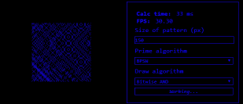
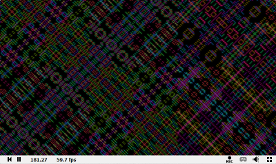

### Программа для генерации бесконечного узора
- *Статья №1 на habr.com* [https://habr.com/post/417861/](https://habr.com/post/417861/)
- *Статья №2 на habr.com* [https://habr.com/post/420225/](https://habr.com/post/420225/)

### Описание
Программа генерирует бесконечный узор, где каждая точка пространства сама определяет свое состояние вне зависимости от других точек. 
Это достигается за счет использования некоторой операции над координатами точки и дальнейшей проверки полученного числа на простоту.
Изначальная идея состояла в проверке числа, полученного операцией X XOR Y, на простоту, где X и Y - координаты точки. Такой простой алгоритм дает следующий узор:


### Как работает данная программа?
Пример кода:
```C++
long long gx; // координата X точки
long long gy; // координата Y точки
// задаем координаты точки
//...

long long temp = gx ^ gy; // основной вариант предварительной обработки координат

// проверка числа temp на простоту
// isprime - это Алгоритм Бэйли-Померанс-Селфридж-Вагстафф (BPSW) проверки n на простоту
if(BPSW::isprime(std::abs(temp)) == true) {
  // точка закрашена, например data[gx][gy] = 1;
} else {
  // точка пустая
}
```

### Пример работы программы
:tv:[Видео1](https://www.youtube.com/watch?v=F84fgTK2kp0).
:tv:[Видео2](https://www.youtube.com/watch?v=Fx0XS5cNrT0).

### Для пользователей Windows
Вы можете воспользоваться готовой программой *2d_pattern.exe*, которая находится в архиве в папке *bin*.
Не забудьте в консоли запустившейся программы ввести ширину и высоту окна.

Также можно сгенерировать звук на основе XOR алгоритма узора. Для этого в папке *bin* есть программа *simple_sound*.
Введите длину трека в секундах, длину одного тика, начальные координаты и скорость смещения. На выходе программа сгенерирует wav файл с мелодией.

**Управление программой:**
Переключитель на экран программы, который отображает узор, и нажимайте соответствующие клавиши. 
Убедитесь, что язык ввода английский.
- W двигаться вверх
- S двигаться вниз
- D двигаться вправо
- A двигаться влево
- F увеличить скорость перемещения
- B сбросить скорость перемещения
- R включить или выключить автоматическое перемещение
- T смена алгоритма
- I сохранить узор в формате jpg
- V начать или остановить запись видео в формате avi

### Реализация алгоритма другими пользователями
* *Программа на JavaScript* [https://mashed-potatoes.github.io/Strange_Pattern.js/](https://mashed-potatoes.github.io/Strange_Pattern.js/)

* *Шейдер на www.shadertoy.com* [https://www.shadertoy.com/view/4tcyWH](https://www.shadertoy.com/view/4tcyWH)
